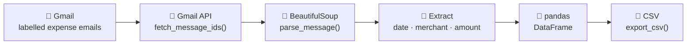

<div align="center">

# 💸 expense-tracker

**Track your monthly spending automatically by scraping expense emails with the Gmail API — without handing your inbox to a third-party app.**

[](https://www.python.org/downloads/)
[](LICENSE)
[](https://developers.google.com/gmail/api)

</div>

---



## Table of Contents

- [Problem Statement](#problem-statement)
- [How It Works](#how-it-works)
- [Prerequisites](#prerequisites)
- [Setup](#setup)
- [Usage](#usage)
- [Example Output](#example-output)
- [Configuration](#configuration)
- [Notes](#notes)
- [License](#license)

## Problem Statement

I wanted to track my expenditure across my two credit cards and UPI account. There are broadly two kinds of apps for this:

1. Apps that ask you to enter expenses **manually**, every time you incur them.
2. Apps that **read through your emails/SMSes** to track them automatically — at the cost of your privacy.

I tried a great manual-entry app called *Expenses - Spending Tracker*. It was intuitive, with a nice iOS widget and CSV export. But manual entry was tedious and I'd forget to log things. At the same time, I didn't want a third party crawling my inbox — so I wrote this small Python script to do it myself, locally.

## How It Works

The script follows the pipeline shown in the diagram above:

1. **Label** — Gmail filters tag every incoming expense email (credit cards, UPI) with a dedicated label on arrival.
2. **Fetch** — the script calls the Gmail API to pull all emails carrying that label since the start of the current month.
3. **Parse** — each email body is parsed with BeautifulSoup.
4. **Extract** — the transaction **date**, **merchant** and **amount** are pulled out of the message text.
5. **Assemble** — the rows are collected into a pandas DataFrame.
6. **Export** — the DataFrame is written to a CSV you can open in any spreadsheet.

Everything runs on your own machine using read-only Gmail access — nothing leaves your computer except the API calls you make to Google.

## Prerequisites

- **Python 3.8+**
- A **Google Cloud project** with the **Gmail API** enabled and an OAuth 2.0 **Desktop app** client. Download the client secret as `credentials.json` and place it in the project root.
- One or more **Gmail labels** that tag your expense emails (a Gmail filter can apply these automatically on arrival).

> See Google's [Gmail API Python quickstart](https://developers.google.com/gmail/api/quickstart/python) for enabling the API and creating credentials.

## Setup

```bash
# 1. Clone the repository
git clone https://github.com/rakshran/expense-tracker.git
cd expense-tracker

# 2. Create and activate a virtual environment
python -m venv .venv
source .venv/bin/activate        # On Windows: .venv\Scripts\activate

# 3. Install dependencies
pip install -r requirements.txt

# 4. Add your OAuth credentials (downloaded from Google Cloud) to the project root
#    -> credentials.json

# 5. Configure environment variables
cp .env.example .env
# Edit .env and set GMAIL_LABEL_ID (and tweak the rest if you like).
```

<details>
<summary><strong>📋 Detailed Google Cloud &amp; label setup</strong></summary>

<br/>

**Enable the Gmail API and create credentials**

1. Go to the [Google Cloud Console](https://console.cloud.google.com/) and create (or pick) a project.
2. Enable the **Gmail API** for that project.
3. Configure the **OAuth consent screen** (External is fine for personal use; add your own email as a test user).
4. Create an **OAuth client ID** of type **Desktop app**.
5. Download the client secret JSON and save it as `credentials.json` in the project root.

**Find your Gmail label ID**

The label ID is **not** the display name you see in Gmail — it looks like `Label_1234567890`. You can retrieve it with the Gmail API's [`users.labels.list`](https://developers.google.com/gmail/api/reference/rest/v1/users.labels/list) endpoint (try it directly in the API Explorer on that page). Copy the `id` of the label you want and put it in `.env` as `GMAIL_LABEL_ID`.

</details>

## Usage

```bash
python scraper.py
```

- On the **first run**, a browser window opens for you to authorize read-only access. A `token.json` is then cached so subsequent runs don't prompt again.
- The script fetches labelled emails from the **start of the current month** and writes the results to:

  ```
  output/<YYYY-MM-01>_credit_card.csv
  ```

## Example Output

The exported CSV looks like this (values below are illustrative):

| date       | merchant            | amount   | mode        |
| ---------- | ------------------- | -------- | ----------- |
| 2026-06-03 | Blue Bottle Coffee  | 540.00   | credit_card |
| 2026-06-07 | Amazon              | 2,199.00 | credit_card |
| 2026-06-11 | Uber                | 318.50   | credit_card |
| 2026-06-15 | BigBasket           | 1,742.00 | credit_card |

## Configuration

All configuration is read from your `.env` file (see [`.env.example`](.env.example)):

| Variable           | Default            | Description                                                         |
| ------------------ | ------------------ | ------------------------------------------------------------------- |
| `GMAIL_USER_ID`    | `me`               | Gmail user ID — `me` for the authenticated account, or your email.  |
| `GMAIL_LABEL_ID`   | _(required)_       | ID of the Gmail label that tags your expense emails.                |
| `OUTPUT_DIR`       | `output`           | Directory where exported CSV files are written.                     |
| `CREDENTIALS_FILE` | `credentials.json` | Path to your Google OAuth client credentials file.                  |
| `TOKEN_FILE`       | `token.json`       | Path where the OAuth token is cached after the first run.           |

> `credentials.json`, `token.json`, `.env` and `output/` are git-ignored, so your secrets and personal data are never committed.

## Notes

The extraction in `parse_message()` slices the email body against a specific template (`for INR ... at ... on ...`). Email formats vary across banks and payment providers, so you'll likely need to tweak that logic to match your own expense emails.

## License

Released under the [MIT License](LICENSE).
